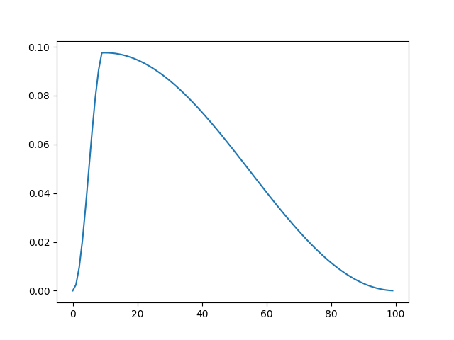

pytorch_warmcosinelr
===

Warmup CosineAnnealingLR for pytorch.



# Usage

The usage is the same as the pytorch scheduler.

```
from WarmCosineAnnealingLR import WarmCosineAnnealingLR

model = torch.hub.load('pytorch/vision:v0.6.0', 'resnet18')
optimizer = optim.SGD(model.parameters(), lr=0.1)

scheduler = WarmCosineAnnealingLR(optimizer, epoch, warmup=10, eta_min=1e-5)

for epoch in range(epoch):
    ...

    optimizer.step()
    scheduler.step()
```

You can find an example in `test.py`.
